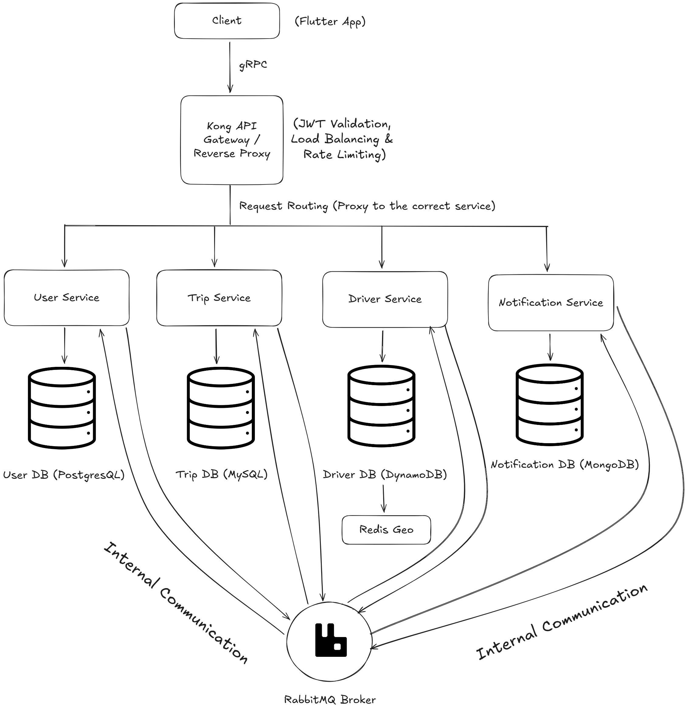
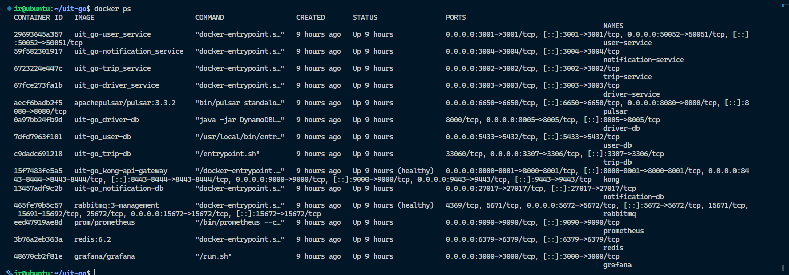

# UIT-Go Backend – Cloud-Native Ride Management

[](https://nestjs.com/)
[](https://www.typescriptlang.org/)
[](https://www.postgresql.org/)
[](https://www.mysql.com/)
[](https://www.rabbitmq.com/)
[](https://redis.io/)
[](https://redis.io/)
[](https://docs.bullmq.io/)
[](https://nodeshift.github.io/opossum/)
[](https://www.docker.com/)
[](https://grafana.com/)
[](https://prometheus.io/)
[](https://k6.io/)
[](https://pulsar.apache.org/)
[](https://www.mongodb.com/)
[](https://aws.amazon.com/dynamodb/)
[](https://konghq.com/)
[](https://grpc.io/)

UIT-Go is a **cloud-native microservices backend system** for a **ride-sharing platform**, developed as part of the **SE360: Cloud-Native System Architecture** course at the **University of Information Technology (UIT)**. Provides **gRPC APIs** for **users, drivers, trips, and notifications**, optimized for **scalability** and **real-time operations**.

The system architecture is designed following **Module A: Scalability & Performance**, employing **microservices**, **distributed databases**, **message queues**, **caching**, and **asynchronous processing** to ensure **high throughput**, **low latency**, and **horizontal scalability** under peak loads.

---

## 📋 Table of Contents

1. [Project Overview](#project-overview)
2. [Key Features](#key-features)
3. [Architecture](#architecture)
4. [Technology Stack](#technology-stack)
5. [Prerequisites](#prerequisites)
6. [Installation & Setup](#installation--setup)
7. [Running the Application](#running-the-application)
8. [Testing Inter-Service Communication](#testing-inter-service-communication)
9. [Project Structure](#project-structure)
10. [Development Guide](#development-guide)
11. [Troubleshooting](#troubleshooting)
12. [Documentation](#documentation)
13. [Team Members](#team-members)
14. [License](#license)

---

## 📖 Project Overview

UIT-Go simulates a real-world ride-sharing platform (similar to Uber/Grab) with a focus on:

- **Microservices Architecture**: Four independent, scalable services + **Kong API Gateway**
- **Cloud-Native Design**: Containerized deployment with Docker
- **Event-Driven Communication**: Asynchronous messaging with RabbitMQ
- **Module A Focus**: Scalability & Performance

---

## 🔑 Key Features

- 🔐 **Authentication & API Gateway**: Kong handles routing, request validation, and JWT-based authentication
- 👤 **User Management**: Handle registration and login for **passengers and drivers**, as well as profile management
- 🧑‍✈️ **Driver Management**: Manage driver profiles, vehicle information, and availability
- 🚗 **Trip Management**: Create, track, and complete ride requests
- 🔔 **Notifications Management**: Manage in-app notifications for trip events
- 📍 **Real-Time Location**: Redis Geospatial for driver location tracking

---

## 🏗 Architecture

UIT-Go is built following a **cloud-native microservices architecture**, composed of the following core services:



**See [ARCHITECTURE.md](docs/ARCHITECTURE.md) for detailed architecture documentation.**

---

## 🛠 Technology Stack

UIT-Go is built using a modern cloud-native stack, combining microservices, message-driven communication, caching, and observability tools to ensure high scalability and performance.

### **Backend & Core Framework**

- **NestJS (TypeScript)**
- **gRPC** – client-facing API communication
- **Opossum** – circuit breaking for service resilience
- **BullMQ** – background job & queue processing

### **Databases & Storage**

- **PostgreSQL** – relational data (User/Trip)
- **MySQL** – service-specific structured storage
- **MongoDB** – flexible notification/event documents
- **DynamoDB** – high-performance geolocation & driver data
- **TypeORM** – ORM for PostgreSQL/MySQL

### **Caching, Locking & Real-time**

- **Redis** – caching, rate limiting
- **Redis Geospatial** – real-time driver location tracking
- **Redlock** – distributed locking to prevent race conditions

### **Messaging & Streaming**

- **RabbitMQ** – inter-service asynchronous communication
- **Apache Pulsar** – event streaming used specifically for trip creation workflows
- **amqplib** – RabbitMQ client for Node.js
- **pulsar-client** – Apache Pulsar messaging client

### **API Communication**

- **@grpc/grpc-js** – gRPC client/server implementation

### **API Gateway & Security**

- **Kong API Gateway** – routing, authentication, rate limiting, JWT validation
- **helmet**, **cors** – security middleware (optional)

### **Containerization & DevOps**

- **Docker** – containerized microservices
- **Docker Compose** – local orchestration

### **Monitoring, Metrics & Performance**

- **Prometheus** – metrics collection
- **Grafana** – dashboards & visualization
- **k6** – performance & load testing

### **Utilities & Developer Tools**

- **class-validator**, **class-transformer** – DTO validation & transformation
- **dotenv** – environment variable management
- **winston / pino** – logging

---

# 📦 Prerequisites

Before you begin, ensure the following tools and services are installed and available in your development environment:

### **Core Requirements**

- **Node.js (v20.x or higher)** – Runtime for all backend services ([Download](https://nodejs.org/en/download/))
- **npm (v10.x or higher)** – Package manager (bundled with Node.js)
- **Docker Desktop (v24.x or higher)** – Required for local infrastructure (DBs, Redis, RabbitMQ, Pulsar...) ([Download](https://www.docker.com/products/docker-desktop))
- **Git** – Version control ([Download](https://git-scm.com/downloads))

---

### **Infrastructure & Cloud Tools**

- **Terraform (v1.8+)** – Infrastructure-as-Code for managing cloud resources ([Download](https://developer.hashicorp.com/terraform/downloads))
- **AWS CLI** – Required if deploying on AWS (ECS/EKS, DynamoDB, S3, etc.) ([Download](https://aws.amazon.com/cli/))

---

### **Databases & Message Brokers**

(You can run most of them via Docker Compose)

- **PostgreSQL** – For User/Trip relational data
- **MySQL** – For service-specific relational storage
- **MongoDB** – For notifications/events
- **Redis** – Caching, rate limiting, distributed locks (Redlock), job queues (BullMQ)
- **RabbitMQ** – Main inter-service message broker
- **Apache Pulsar (optional)** – Used only for Trip Creation event streaming
- **DynamoDB** – High-performance geolocation storage (if running locally, use DynamoDB Local or AWS)

---

### **Optional but Recommended Tools**

- Visual Studio Code + extensions:

  - NestJS Snippets
  - ESLint
  - Prisma / SQL Tools
  - Terraform

- Database Clients:

  - pgAdmin / DBeaver / TablePlus

- API Testing Tools:

  - Postman / Insomnia

- Realtime Debugging / Monitoring:

  - Grafana & Prometheus (if used locally)

---

# 🚀 Installation & Setup

### 1. Clone the Repository

```bash
git clone https://github.com/lengocanh2005it/uit-go.git
cd uit-go/app/nestjs
```

### 2. Install Dependencies

```bash
npm install
```

### 3. Configure Global Environment Variable

Set a common decryption key for all encrypted `.env` files. This key will be used by **all services**:

```bash
export DOTENV_PRIVATE_KEY="your_private_key_here"
```

### 4. Configure Environment Variables for Each Service

Before running a service, set the decryption key for its encrypted `.env` file. The `.env` files are located as follows:

- **Driver Service**: `/apps/driver/.env`
- **Trip Service**: `/apps/trip/.env`
- **User Service**: `/apps/user/.env`
- **Notification Service**: `/apps/notification/.env`

Export the key for each service before starting it:

```bash
# Driver Service
export DOTENV_PRIVATE_KEY="your_private_key_here"

# Trip Service
export DOTENV_PRIVATE_KEY="your_private_key_here"

# User Service
export DOTENV_PRIVATE_KEY="your_private_key_here"

# Notification Service
export DOTENV_PRIVATE_KEY="your_private_key_here"

```

### 5. Create Secrets Folder and Key Files

For secure local development, create a `secrets` folder to store your keys and database password:

```bash
mkdir -p /secrets
```

Inside the `secrets` folder, create the following files:

- `dotenv_driver_key.txt` – Paste the **DOTENV_PRIVATE_KEY** for **Driver Service**
- `dotenv_trip_key.txt` – Paste the **DOTENV_PRIVATE_KEY** for **Trip Service**
- `dotenv_user_key.txt` – Paste the **DOTENV_PRIVATE_KEY** for **User Service**
- `dotenv_notification_key.txt` – Paste the **DOTENV_PRIVATE_KEY** for **Notification Service**
- `mongo_root_password.txt` – Paste your **MongoDB root password**

You can create and populate these files using the following commands:

```bash
echo "your_driver_private_key_here" > /secrets/dotenv_driver_key.txt
echo "your_trip_private_key_here" > /secrets/dotenv_trip_key.txt
echo "your_user_private_key_here" > /secrets/dotenv_user_key.txt
echo "your_notification_private_key_here" > /secrets/dotenv_notification_key.txt
echo "your_mongo_root_password_here" > /secrets/mongo_root_password.txt
```

---

# 🏃 Running the Application

Before running the services, make sure you are in the `/app/nestjs` folder. If not, navigate there:

```bash
cd /app/nestjs
```

### 1. Start All Services with Docker Compose

You have two options to build and start all services and infrastructure containers.

**Option 1: Using the npm helper script**

```bash
npm run up
```

This command will:

- Build all Docker images for the services
- Start local infrastructure containers (PostgreSQL, MySQL, MongoDB, Redis, RabbitMQ, Pulsar)
- Launch all NestJS backend services

**Option 2: Manual build and start with dotenvx**

```bash
npm run build
dotenvx run -- docker compose up -d
```

This approach will:

- Build all backend service images separately
- Use **dotenvx** to provide the encrypted **.env** keys to the containers
- Start the Docker Compose stack in detached mode

### 2. Verify Running Services

Check that all containers are up and running:

```bash
docker ps
```

You should see containers for all services and infrastructure listed above.



> Screenshot showing all backend services and infrastructure containers running via Docker Compose.

### 3. Stop the Application

To stop all running services and containers, you can use one of the following commands:

```bash
# Using the npm helper script
npm run down

# Or using Docker Compose directly
docker compose down
```

# 🧪 Testing Inter-Service Communication

### 1. Health Check

Each backend service exposes a **gRPC Health Checking Service**. You can test it via **Kong gRPC proxy** using `grpcurl`.

```bash
# Check Driver Service
grpcurl -plaintext localhost:9000 driver.DriverService.Health/Check
# Expected Response:
# {
#   "status": "SERVING"
# }

# Check Trip Service
grpcurl -plaintext localhost:9000 trip.TripService.Health/Check
# Expected Response:
# {
#   "status": "SERVING"
# }

# Check User Service
grpcurl -plaintext localhost:9000 user.UserService.Health/Check
# Expected Response:
# {
#   "status": "SERVING"
# }

# Check Notification Service
grpcurl -plaintext localhost:9000 notification.NotificationService.Health/Check
# Expected Response:
# {
#   "status": "SERVING"
# }

```

---

### 2. Test Authentication Flow

**Register a new passenger or driver using **gRPC** via Kong proxy (`localhost:9000`):**

```bash
grpcurl -plaintext -d '{
  "email": "passenger@test.com",
  "password": "Test@1234",
  "full_name": "Test User",
  "phone_number": "+84901234567",
  "address": "123 Main St, HCMC",
  "role": "customer",
  "birth_day": "1990-01-01"
}' localhost:9000 user.UserService.Register

# Expected Response:
# {
#   "message": "Your account has been created.",
#   "success": true,
#   "data": {
#     "sub": "b61f72cd-725c-44af-9a8e-70c48777f307",
#     "full_name": "Test User",
#     "email": "passenger@test.com",
#     "role": "customer"
#   }
# }
```

**Login a passenger or driver using **gRPC** via Kong proxy (`localhost:9000`):**

```bash
grpcurl -plaintext -d '{
  "email": "passenger@test.com",
  "password": "Test@1234"
}' localhost:9000 user.UserService.Login

# Expected Response:
# {
#   "message": "Login successful.",
#   "data": {
#     "access_token": "jwt-access-token",
#   }
# }

```

Save the returned **`access_token`** for subsequent requests.

---

### 3. Test Trip Creation Flow (Trip Service → Driver Service) via gRPC

**Create a Trip Request using gRPC via Kong proxy (`localhost:9000`):**

```bash
grpcurl -plaintext \
  -H "Authorization: Bearer <your_access_token>" \
  -d '{
    "original_address": "123 Main St, HCMC",
    "destination_address": "456 Nguyen Trai, HCMC"
  }' localhost:9000 trip.TripService.CreateTrip

  # Expected Response:
# {
#   "message": "Your trip request is being processed. You will receive a notification as soon as there is an update."
# }
```

**What happens behind the scenes:**

1. **Request → Kong API Gateway (gRPC)**
   - Client sends a gRPC request to create a trip via Kong.
2. **Trip Service → DriverAssignmentProducer**
   - Trip Service publishes a new trip creation event to the assignment producer.
3. **DriverAssignmentProducer → Apache Pulsar**
   - The event is streamed through Pulsar to trigger driver assignment workflows.
4. **Circuit Breaker → RabbitMQ Broker → Driver Service**
   - Using **Opossum**, the event is sent to RabbitMQ.
   - Driver Service consumes the event, searches nearby drivers via **Redis Geospatial**, and returns an array of available drivers.
5. **DriverAssignmentConsumer → Create Trip with Concurrency Control**
   - Loops over available drivers.
   - Uses **Redlock** + **Opossum** to avoid race conditions.
   - Creates a new trip and new trip request.
6. **RabbitMQ → Notification Service**
   - Trip creation triggers events in RabbitMQ to generate **in-app notifications** for both the assigned driver and the passenger.

---

### 4. Test RabbitMQ Message Flow

Access RabbitMQ Management UI:

- URL: http://localhost:15672
- Username: **`guest`**
- Password: **`guest`**

Navigate to Queues tab to see:

- **`trip.q`** - Trip events
- **`driver.q`** - Driver events
- **`notification.q`** - Notification events
- **`user.q`** - User events

---

### 5. Test Driver Status Update (gRPC)

Update driver status using **gRPC** via Kong proxy (`localhost:9000`) with **Authorization header**:

```bash
grpcurl -plaintext \
  -H "Authorization: Bearer <your_access_token>" \
  -d '{
    "driver_id": "caa29287-b8cd-4ad0-bf71-f2d1bd54944d",
    "status": "online",
    "current_location": "120 Nguyễn Huệ, Phường Bến Nghé, Quận 1, TP. Hồ Chí Minh"
  }' localhost:9000 driver.DriverService.UpdateDriverStatusGrpc

# Expected Response:
# {
#   "message": "Status updated successfully.",
#   "data": {
#     "driverId": "faee5492-2d5f-4c1b-9e01-fd8875dea633",
#     "status": "online"
#   }
# }

```

**Verify in Redis:**

**_Connect to the Redis container and check the driver’s current location using Redis Geospatial commands:_**

```bash
# Enter the Redis container
docker exec -it redis redis-cli

# Check driver location by ID
GEOPOS drivers:locations <driver_id_here>

# Expected Output:
# 1) 1) "106.7034"    # longitude
#    2) "10.7766"     # latitude
```

---

# 📁 Project Structure

```text
uit-go/
├── app/
│   ├── kong/                  # API Gateway (Kong)
│   │   ├── Dockerfile         # Dockerfile for Kong
│   │   └── kong.yml           # Kong configuration
│   ├── nestjs/                # NestJS backend services
│   │   ├── apps/
│   │   │   ├── driver/        # Driver & location service
│   │   │   │   ├── .env       # Encrypted environment file
│   │   │   │   ├── Dockerfile
│   │   │   │   └── Dockerfile.db
│   │   │   ├── notification/  # Notification service
│   │   │   │   ├── .env
│   │   │   │   ├── Dockerfile
│   │   │   │   ├── Dockerfile.db
│   │   │   │   └── entrypoint.sh
│   │   │   ├── trip/          # Trip management service
│   │   │   │   ├── .env
│   │   │   │   ├── Dockerfile
│   │   │   │   ├── Dockerfile.db
│   │   │   │   └── entrypoint.sh
│   │   │   └── user/          # User management service
│   │   │       ├── .env
│   │   │       ├── Dockerfile
│   │   │       ├── Dockerfile.db
│   │   │       └── entrypoint.sh
│   │   ├── dist/              # Build output
│   │   ├── libs/
│   │   │   └── common/        # Shared library for all services
│   │   │       └── src/
│   │   │           ├── configs/
│   │   │           ├── constants/
│   │   │           ├── decorators/
│   │   │           ├── enums/
│   │   │           ├── guards/
│   │   │           ├── pipes/
│   │   │           ├── utils/
│   │   │           ├── common.module.ts
│   │   │           ├── common.service.ts
│   │   │           └── index.ts
│   │   ├── .env               # Global environment for NestJS
│   │   ├── proto/             # gRPC proto definitions
│   │   ├── scripts/           # Setup and build scripts
│   │   ├── docker-compose.yml # Local development compose file
│   │   ├── .dockerignore
│   │   ├── nest-cli.json
│   │   ├── package-lock.json
│   │   ├── package.json
│   │   └── redis.conf         # Redis configuration
├── docs/                      # Documentation
│   ├── adr/                   # Architectural Decision Records
│   ├── images/                # Images for README/ARCHITECTURE.md
│   ├── ARCHITECTURE.md        # Detailed architecture document
│   └── REPORT.md              # Project report
├── infra/                     # Infrastructure as Code (Terraform)
│   ├── modules/
│   │   ├── dynamodb/          # DynamoDB module
│   │   ├── ecs_services/      # ECS Services module
│   │   ├── iam/               # IAM module
│   │   ├── kong/              # Kong infrastructure module
│   │   ├── rabbitmq/          # RabbitMQ module
│   │   ├── rds/               # RDS module
│   │   ├── redis/             # Redis module
│   │   └── vpc/               # VPC network module
│   ├── monitoring/
│   │   ├── k6/                # Load testing scripts
│   │   └── prometheus/        # Prometheus configuration
│   ├── .terraform.lock.hcl
│   ├── main.tf
│   ├── outputs.tf
│   ├── providers.tf
│   ├── terraform.tfvars
│   └── variables.tf
└── README.md                  # Project README

```

---

# 💻 Development Guide

### 🔑 1. Get Private Keys

Contact our team to obtain the private keys for each service's encrypted `.env` files.

---

### ⚡ 2. Generate gRPC TypeScript Definitions

This will regenerate TypeScript definitions for all gRPC services.

```bash
cd /app/nestjs
npm run gen:proto
```

---

### 🛠 3. Create a New Service or Library

- **New service**:

```bash
  cd /app/nestjs/apps
  nest generate app <service_name>
```

- **New library**:

```bash
  cd /app/nestjs/apps
  nest generate lib <lib_name>
```

---

### 🏃 4. Run a Service in Development Mode

```bash
  cd /app/nestjs/apps/<service_name>
  export DOTENV_PRIVATE_KEY="your_private_key_here"
  npm run start:dev
```

---

# 🐛 Troubleshooting

### Issue: Docker containers fail to start

**Solution:**

```bash
# Remove all containers and volumes
docker-compose down -v

# Rebuild and start all containers
docker-compose up --build
```

---

### Issue: Port already in use

**Solution:**

```bash
# Check which process is using the port (example: 5432)
netstat -ano | findstr :5432

# Kill the process (replace <PID> with actual PID)
taskkill /PID <PID> /F

# Or change the port in docker-compose.yml
```

---

### Issue: RabbitMQ connection refused

**Solution:**

```bash
# Restart RabbitMQ container
docker-compose restart rabbitmq

# Check RabbitMQ logs
docker-compose logs rabbitmq

# Ensure the container is running
docker ps | grep rabbitmq
```

---

### Issue: gRPC method not implemented

**Solution:**

```bash
# Regenerate TypeScript definitions from proto files
cd /app/nestjs
npm run gen:proto

# Rebuild all backend services
npm run build
```

---

# 📚 Documentation

All project documentation is centrally organized in the `/docs` directory for easy reference and navigation:

- [ARCHITECTURE.md](/docs/ARCHITECTURE.md) — Detailed system architecture
- [REPORT.md](/docs/REPORT.md) — Project report with trade-offs analysis
- [ADR/](/docs/adr/) — Architectural Decision Records

  - ADR-001: Choosing RabbitMQ Instead of Kafka for Event-Driven Messaging
  - ADR-002: API Gateway Choice – Kong Gateway
  - ADR-003: Database Choice – Polyglot Persistence
  - ADR-004: Observability Stack – Grafana and Prometheus
  - ADR-005: K6 Load Testing
  - ADR-006: Monorepo Structure for Microservice Management
  - ADR-007: Infrastructure as Code with Terraform
  - ADR-008: Redis Adoption – Low-Latency Caching & Realtime Scalability
  - ADR-009: Choose gRPC Over REST For Client-Facing Communication

- [IMAGES/](/docs/images/) — Project diagrams, flowcharts, and visual assets

---

# 👥 Team Members

**Course**: SE360 – Cloud Computing and Modern Application Development  
**University**: University of Information Technology (**UIT**)  
**Class**: SE360.Q11  
**Semester**: 1st Semester, 2025-2026

| Name               | Student ID | Responsibilities                                                                                              |
| ------------------ | ---------- | ------------------------------------------------------------------------------------------------------------- |
| Lê Ngọc Anh        | 23520048   | Project Init, Trip Service, Notification Service, Terraform, Docker Compose, Documentation                    |
| Lê Văn Bảo         | 23520112   | Kong API Gateway, Database Design, Driver Service, Prometheus + Grafana Integration, Documentation            |
| Nguyễn Bá Tuấn Anh | 23520054   | User Service, RabbitMQ + Apache Pulsar Integration, K6 Load Test, Redis Geo Hashing + DynamoDB, Documentation |

---

# 📄 License

This project is licensed under the MIT License — see the [LICENSE](/docs/LICENSE) file for details.

---

# 🙏 Acknowledgments

- **NestJS** — for providing a powerful and modular backend framework.
- **Kong API Gateway** — for enabling reliable and scalable API traffic management.
- **Docker** — for containerization and simplified local development.
- **Redis** — for caching, real-time location tracking, and distributed locks.
- **RabbitMQ & Apache Pulsar** — for supporting asynchronous messaging and event-driven workflows.
- **gRPC** — for fast and efficient client-facing APIs.
- **Course Instructor** — for continuous guidance and valuable insights throughout the project.

---

# 📞 Contact

For questions or support, please reach out to:

- Email: 23520048@gm.uit.edu.vn
- Repository: https://github.com/lengocanh2005it/uit-go.git

---

Built with ❤️ by a team of 3 aspiring Software Engineers
