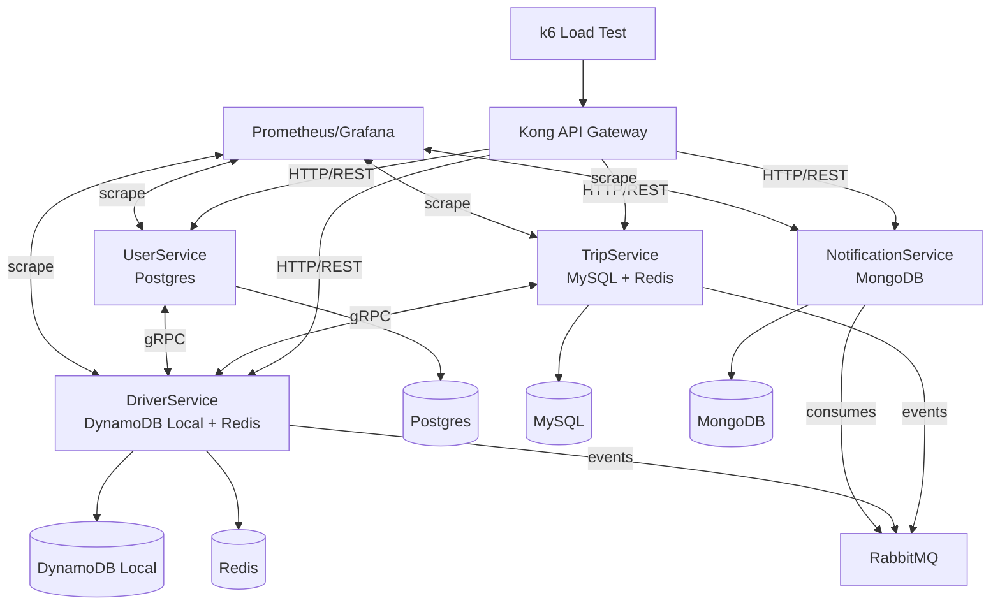
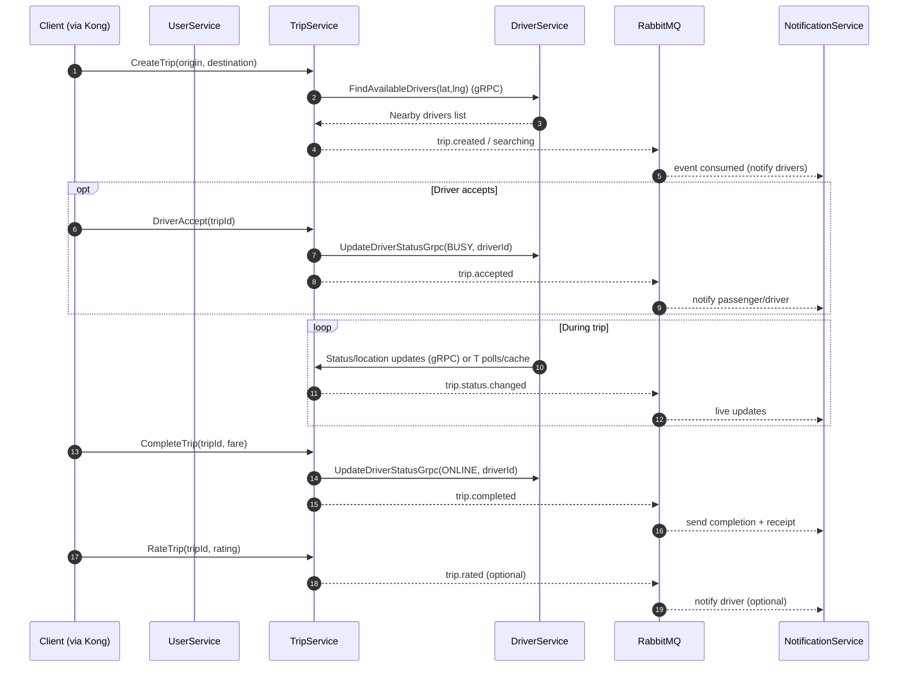

# UIT-Go Architecture (Module A - Scalability & Performance)

This document aligns the UIT-Go system with the SE360 requirements (skeleton microservices + deep dive into Module A).

## System Overview
- **Architecture style:** gRPC-based microservices in a NestJS monorepo. Kong acts as the API gateway; AWS ingress (API Gateway + ALB) is discussed only in Module A.
- **Core services:** User, Trip, Driver, Notification. Each owns its database (polyglot persistence).
- **Data plane:** gRPC for client calls; RabbitMQ for RPC-style calls and events; Pulsar for trip creation stream; BullMQ (Redis) for delayed/retried jobs; Redis geospatial cache for fast driver lookup.
- **Resilience and performance pillars (Module A focus):**
  - Asynchronous workflows (Pulsar topic `trip-create`, RabbitMQ events, BullMQ timers) to absorb bursty demand.
  - Geospatial caching + DynamoDB durability for driver locations.
  - Circuit breakers (`opossum`), idempotency records, and outbox pattern for reliable cross-service delivery.
  - Multi-AZ data stores and active/passive brokers to remove single points of failure.

## Runtime Topology (Local)
| Component | Responsibility | Interface | Persistence/State |
| --- | --- | --- | --- |
| Kong API Gateway | Edge ingress and routing to services | HTTP/gRPC | Stateless |
| User Service | Auth (JWT), user/profile CRUD, optional driver onboarding trigger | gRPC; RabbitMQ RPC to Driver/Notification | PostgreSQL |
| Trip Service | Trip lifecycle, fare estimation, driver assignment orchestration, ratings | gRPC; Pulsar producer/consumer; RabbitMQ RPC/events; BullMQ timers | MySQL |
| Driver Service | Driver/vehicle records, approval, status/location tracking, availability search | gRPC; RabbitMQ consumers/RPC | DynamoDB Local + Redis (geo cache) |
| Notification Service | Notification templates and user notifications | gRPC; RabbitMQ consumer | MongoDB |
| Messaging | Reliable async bus and geo cache | RabbitMQ; Redis/Redlock | Broker state; in-memory cache |
| Streaming | Trip creation queue with DLQ | Pulsar topic `trip-create` + DLQ | Persistent log |
| Observability | Metrics, logs, dashboards | Prometheus/Grafana, service logs | Managed locally |
| Load Testing | Traffic generation for perf validation | k6 -> Kong API Gateway | Stateless |

## Local Runtime Diagram

## Communication Patterns (Local)
- **Ingress:** Kong routes gRPC services (`/user.UserService`, `/trip.TripService`, `/driver.DriverService`, `/notification.NotificationService`).
- **Sync calls:** gRPC from clients; RabbitMQ RPC between services (e.g., driver info, profile lookup, available drivers) wrapped in circuit breakers and fallbacks.
- **Async and buffering:**
  - **Pulsar:** Trip creation and driver assignment (`trip-create` topic) with DLQ for passenger failure notification.
  - **RabbitMQ events:** Driver status updates, driver rating updates, notification creation, and other cross-service events. Outbox tables + BullMQ workers publish every 5s.
  - **BullMQ (Redis):** Delayed jobs (trip request timeout, staged status transitions) and recurring outbox publisher.
- **Geo and caching:** Redis stores driver geo positions (`drivers:locations`) and online set; Redlock ensures exclusive driver assignment. DynamoDB stores durable driver/location/status with `ProcessedEvent` to skip duplicates.

## Data & Persistence (Polyglot)
- **User:** PostgreSQL (TypeORM) entities `User`, `UserProfile`, `OutboxEvent`; JWT configuration shared via `CommonModule`.
- **Trip:** MySQL (TypeORM) entities `Trip`, `TripRequest`, `TripRating`, `OutboxEvent`; fare estimation via `CommonService`; outbox emits driver status/rating updates.
- **Driver:** DynamoDB tables for driver, status, location (geohash), approval, vehicle, processed events; Redis mirrors online/geo state for low-latency search.
- **Notification:** MongoDB collections `Notification`, `UserNotification`; events consumed from RabbitMQ.

## Core Flows (Performance-Oriented)
1) **User onboarding/login**
   - Register creates user + profile; if driver, emits RabbitMQ command to create driver records and triggers admin notification.
   - Login issues JWT; driver login validates approval via RabbitMQ. If online, an outbox event updates driver status in Driver Service.
2) **Trip request and driver assignment**
   - `createTrip` gRPC -> Trip Service -> publishes to Pulsar `trip-create`.
   - Consumer resolves geo (Geoapify via `CommonService`), fetches available drivers via RabbitMQ, locks a driver with Redlock, persists `Trip` + `TripRequest`, schedules timeout, and notifies the driver.
   - DLQ consumer notifies passenger if retries exhausted.
3) **Trip lifecycle**
   - Status transitions persisted in MySQL; BullMQ can delay transitions (e.g., ARRIVING).
   - Outbox events propagate driver status updates (busy/online) to Driver Service; processed-event table avoids duplicates.
   - Notifications fire on request, arriving, started, completed, cancelled.
4) **Ratings and cancellations**
   - Ratings create `TripRating` and emit outbox events for Driver Service to recompute averages and notify drivers.
   - Cancellations publish notifications and, when needed, reset driver availability.
  
## Trip Flow (Sequence)

## Module A: Scalability & Performance Design

- **Burst absorption:** Asynchronous path (Pulsar + RabbitMQ + BullMQ) decouples passenger requests from driver assignment latency and isolates broker spikes from core services.
- **Data isolation:** Per-service databases prevent noisy-neighbor effects; MySQL/Postgres use multi-AZ replicas; DocumentDB uses primary/replica; DynamoDB provides AZ-spread storage.
- **Low-latency driver lookup:** Redis geospatial queries with top-N selection, backed by DynamoDB durability. Redlock avoids double-assigning the same driver.
- **Reliability patterns:** Circuit breakers with fallbacks; outbox + retries; processed-event dedup; DLQ for failed trip assignments.
- **Autoscaling hooks:** ECS/Fargate services can scale on queue depth (RabbitMQ/BullMQ), CPU/memory, or request count; ElastiCache and RDS configured with replicas/standby for failover.
- **Load/perf validation (plan):**
  - k6/Gatling scenarios: trip creation spike, driver login/update, notification fan-out.
  - Metrics: p95 latency for trip create and driver search, queue depth, assignment success rate, cache hit ratio, CPU/memory of brokers and services.
  - Targets: sustain 1k+ trip-create req/s during spikes with <200 ms p95 for driver availability lookup; keep RabbitMQ publish->consume under 70 ms for status updates.

## Deployment
- **Local/dev:** `app/nestjs/docker-compose.yml` runs Kong, services, Postgres (5433), MySQL (3307), DynamoDB local (8005), MongoDB (27017), RabbitMQ (5672/15672), Redis (6379), Pulsar (6650/8080). Each service has its Dockerfile and secrets via Docker secrets.
- **AWS (per draw.io):**
  - VPC with public (API Gateway/ALB/NAT) and private subnets across AZ A/B.
  - ECS Fargate tasks for User, Trip, Driver, Notification in both AZs behind ALB -> Kong.
  - Data layer: RDS Postgres primary/standby, RDS MySQL primary/standby, DocumentDB primary/replica, DynamoDB global service, ElastiCache Redis primary/replica, RabbitMQ active/passive.
  - Observability: CloudWatch Logs, Managed Prometheus/Grafana dashboards; K9s/ECS console for runtime ops.

## Trade-offs and Decisions (selected)
- **gRPC + Kong vs REST:** Chosen for low latency and strong contracts between microservices; complexity is higher than REST but fits performance goals.
- **RabbitMQ (ADR-001) vs Kafka:** Lightweight, lower latency, easier local/dev; sacrifices deep replay and long-term retention.
- **Polyglot persistence (ADR-003):** Best-fit DB per service for performance; increases operational overhead.
- **Kong vs alternatives (ADR-002):** Plugin ecosystem and gRPC support; adds initial config complexity.
- **Redis geo cache vs DynamoDB-only:** Cache delivers sub-50 ms proximity search; DynamoDB provides durability and replay; requires invalidation/consistency handling.