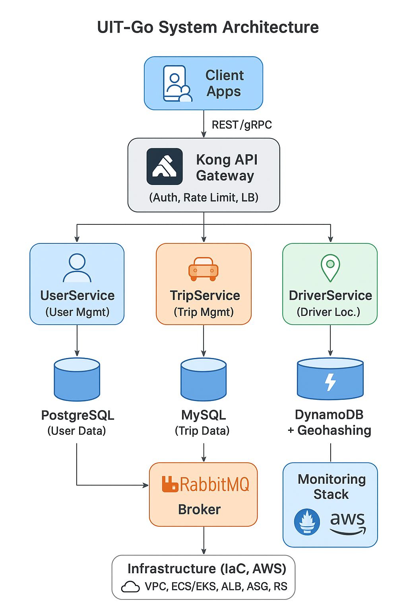
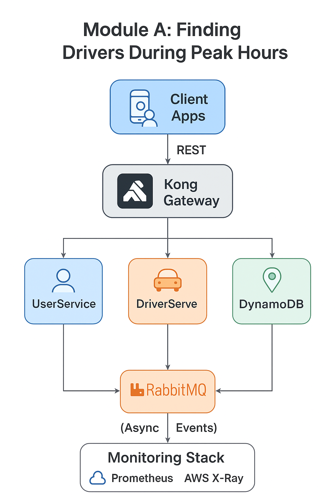

# UIT-Go System Architecture

## 🧩 1. Overview

UIT-Go là một nền tảng gọi xe được thiết kế theo kiến trúc **microservices**, triển khai theo hướng **cloud-native**.  
Mỗi service có cơ sở dữ liệu riêng và giao tiếp qua **Kong API Gateway** hoặc **RabbitMQ** để đảm bảo khả năng mở rộng (scalability) và hiệu năng (performance).

### 🔹 Sơ đồ kiến trúc hệ thống tổng quan

### 🔹 Thành phần chính

| Thành phần | Công nghệ | Vai trò |
|-------------|------------|---------|
| **Kong API Gateway** | Kong Gateway | Cổng vào duy nhất của hệ thống, quản lý xác thực, rate limiting, routing và cân bằng tải. |
| **UserService** | Node.js + PostgreSQL | Quản lý thông tin người dùng, đăng ký, đăng nhập, hồ sơ. |
| **TripService** | Node.js + MySQL | Xử lý logic chuyến đi, tính toán giá, trạng thái chuyến, và giao tiếp với DriverService qua RabbitMQ. |
| **DriverService** | Node.js + DynamoDB (Geohashing) | Quản lý vị trí và trạng thái tài xế, hỗ trợ tìm kiếm tài xế gần nhất. |
| **RabbitMQ** | Message Broker | Trung gian truyền thông bất đồng bộ giữa TripService và DriverService, giúp hệ thống không nghẽn khi lượng đặt xe tăng cao. |
| **Monitoring Stack** | Prometheus, AWS X-Ray | Theo dõi độ trễ, throughput và bottleneck trong hệ thống. |
| **Infrastructure (IaC)** | AWS ECS/EKS, Terraform | Đảm bảo khả năng tái tạo hạ tầng, mở rộng linh hoạt bằng Auto Scaling. |

---

## ⚙️ 2. Module A — Scalability & Performance  
### Tối ưu luồng **Tìm kiếm tài xế trong giờ cao điểm**

Module này tập trung vào việc tối ưu hoá **hiệu năng và khả năng mở rộng** của hệ thống trong trường hợp cao điểm (nhiều hành khách cùng đặt xe).

### 🔹 Sơ đồ chi tiết module chuyên sâu

### 🔹 Luồng xử lý

1. **Passenger App** gửi yêu cầu đặt xe → **Kong Gateway** → **TripService** (`POST /trips`).  
2. **TripService** phát sự kiện `FIND_DRIVER` lên **RabbitMQ** để tìm tài xế.  
3. **DriverService** nhận message, dùng **DynamoDB + Geohashing** để truy vấn tài xế gần nhất đang “Online”.  
4. Khi tìm được tài xế, **DriverService** gửi phản hồi `DRIVER_FOUND` về lại **TripService**.  
5. **TripService** cập nhật thông tin chuyến và gửi thông báo real-time đến hành khách (WebSocket hoặc SNS).  

---

### 🔹 Kỹ thuật tối ưu được áp dụng

| Mục tiêu | Giải pháp kỹ thuật | Hiệu quả |
|-----------|-------------------|-----------|
| **Scalability** | RabbitMQ làm message queue để giao tiếp bất đồng bộ | Giảm tải đột biến, tránh nghẽn API |
| **Performance** | Sử dụng DynamoDB + Geohashing | Tìm kiếm tài xế gần nhanh và rẻ |
| **Caching** | Cache tạm kết quả tìm kiếm (5–10 giây) | Giảm truy vấn lặp |
| **Auto Scaling** | Scale out TripService và DriverService theo queue length | Ổn định khi nhiều request đồng thời |
| **Monitoring** | Prometheus + X-Ray | Theo dõi latency và throughput theo thời gian thực |

---

## 🧠 3. Trade-offs & Design Decisions

| Quyết định | Lý do | Đánh đổi |
|-------------|-------|-----------|
| **Dùng RabbitMQ thay vì REST trực tiếp** | Tăng khả năng chịu tải, xử lý bất đồng bộ | Tăng độ phức tạp về message queue management |
| **Dùng DynamoDB thay Redis Geo** | Giảm chi phí và tăng khả năng mở rộng ghi (write scalability) | Tốc độ truy vấn thấp hơn Redis đôi chút |
| **Dùng Kong Gateway** | Hỗ trợ plugin mạnh mẽ, quản lý traffic dễ dàng | Tăng độ phức tạp khi cấu hình ban đầu |
| **Triển khai IaC với Terraform** | Dễ dàng tái tạo hạ tầng trên AWS | Cần thời gian làm quen Terraform |

---

## 🧾 4. Kết luận

Kiến trúc của hệ thống UIT-Go đảm bảo **hiệu năng, khả năng mở rộng và tính độc lập của các service**.  
Module A – **Tìm kiếm tài xế trong giờ cao điểm** chứng minh khả năng **xử lý tải cao, độ trễ thấp** nhờ thiết kế **asynchronous microservices** sử dụng **RabbitMQ** và **DynamoDB Geohashing**.
