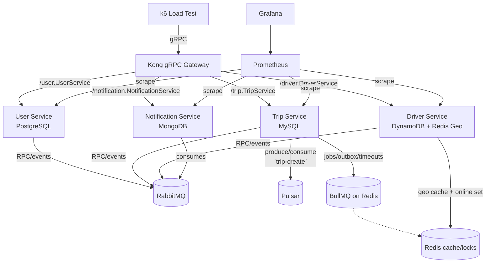
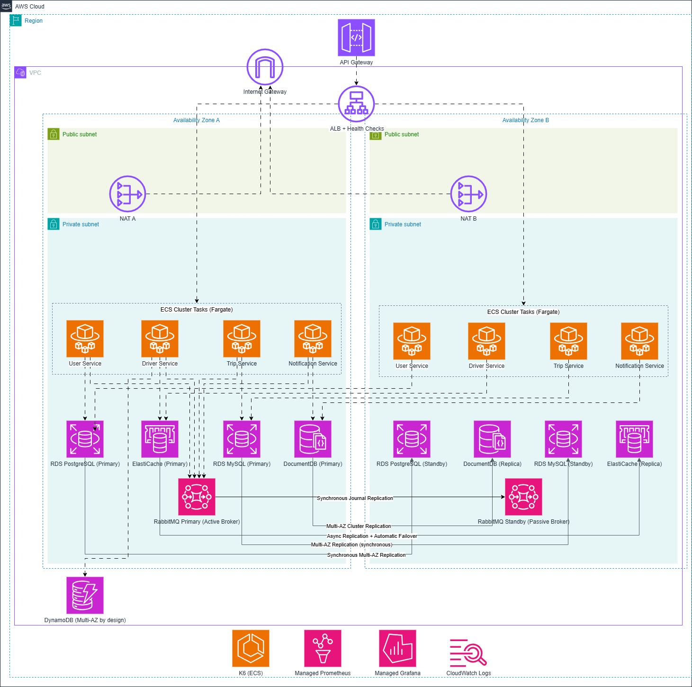

# UIT-Go Architecture (Current Codebase Alignment)

This document aligns the UIT-Go system with the SE360 requirements (skeleton microservices + deep dive into Module A)

## Service Inventory (Local runtime)
| Component | Responsibilities | Interfaces | Persistence/State |
| --- | --- | --- | --- |
| Kong API Gateway | gRPC ingress/proxy configured declaratively (`app/kong/kong.yml`) | gRPC on 9000 -> `/user.UserService`, `/trip.TripService`, `/driver.DriverService`, `/notification.NotificationService` | Stateless |
| User Service | Auth/login, profile CRUD, driver onboarding trigger, outbox publisher, metrics | gRPC 50051 via Kong; RabbitMQ RPC to Driver for approvals/info/create; emits notifications via RabbitMQ; BullMQ outbox job | PostgreSQL (`User`, `UserProfile`, `OutboxEvent`) |
| Trip Service | Trip lifecycle, fare estimation, driver assignment orchestration, ratings, metrics | gRPC 50052 via Kong; Pulsar producer/consumer on `trip-create` (+ DLQ); RabbitMQ RPC/events to Driver/User/Notification; BullMQ queues (`trip_request_queue`, `trip_status_queue`, outbox); Redlock via Redis | MySQL (`Trip`, `TripRequest`, `TripRating`, `OutboxEvent`) |
| Driver Service | Driver/vehicle records, approvals, status/location updates, available-driver search, dedup of processed events, metrics | gRPC 50053 via Kong; RabbitMQ RPC/events (`find_available`, `create`, `get-info`, `update-status`, `update-rate`, etc.); Redis geospatial + availability cache | DynamoDB Local (`driver`, `driver_status`, `driver_location`, `driver_approval`, `vehicle`, `processed_event`); Redis sets `drivers:locations`, `online_drivers` |
| Notification Service | Notification templates and user notifications | gRPC 50054 via Kong; RabbitMQ event consumer `notification.create-notification` | MongoDB (`Notification`, `UserNotification`) |
| Messaging & Async | Internal RPC/events, streaming, background jobs | RabbitMQ queues `${service}_queue`; Pulsar topic `trip-create` + DLQ; BullMQ on Redis (outbox + trip timers) | Broker state + Redis |

## Local Runtime Diagram

## Communication & Reliability Patterns
- **gRPC ingress:** Kong proxies HTTP/2 traffic on 9000 to service gRPC servers (50051–50054). Protos live in `app/nestjs/proto`. `JwtGrpcGuard` enforces authentication; `ThrottlerGrpcGuard` rate-limits trip creation per passenger.
- **RabbitMQ RPC/events:** Nest microservice transport over queues named `${service}_queue` (see `libs/common/constants/patterns.ts`). Used for driver onboarding/lookup, driver status/rate updates, trip/notification events. Circuit breakers (`opossum`) wrap outbound calls in User/Trip services.
- **Pulsar streaming:** `trip-create` topic drives driver assignment; DLQ `trip-create-dlq` handled by `DriverAssignmentDLQConsumer` to notify passengers after retries.
- **BullMQ on Redis:** Repeating outbox publisher every 5s, trip request timeout handling (`trip_request_queue`), trip status transitions (`trip_status_queue`), and outbox processors in User/Trip services.
- **Redis usage:** Geospatial driver positions (`drivers:locations`), availability set (`online_drivers`), cached availability results (30s), distributed locks via Redlock during assignment, per-user throttling counters, BullMQ backing store.
- **Reliability/consistency:** Outbox tables drive idempotent event delivery; driver service stores `processed_event` records to drop duplicates; Redlock prevents double-assigning drivers; fallbacks on circuit breakers return safe defaults.

## Data & Persistence
| Area | Storage | Notes |
| --- | --- | --- |
| User | PostgreSQL via TypeORM (`User`, `UserProfile`, `OutboxEvent`) | Outbox events published through BullMQ + RabbitMQ |
| Trip | MySQL via TypeORM (`Trip`, `TripRequest`, `TripRating`, `OutboxEvent`) | Uses Redlock + RabbitMQ for driver status propagation and notifications |
| Driver | DynamoDB Local via Dynamoose (`driver`, `driver_status`, `driver_location`, `driver_approval`, `vehicle`, `processed_event`) | Redis mirrors geo + availability for low-latency search |
| Notification | MongoDB via Mongoose (`Notification`, `UserNotification`) | Consumes events and serves gRPC reads/writes |
| Shared | Redis, RabbitMQ, Pulsar | Redis for cache/locks/BullMQ; RabbitMQ for RPC/events; Pulsar for trip assignment stream |

## Core Flows (Repository Implementation)
1) **Identity & driver onboarding**
   - `Register` (gRPC) creates user + profile in PostgreSQL; optional driver info triggers RabbitMQ `driver.create` RPC guarded by circuit breakers.
   - Login issues JWT; driver login validates approval status via RabbitMQ. When a driver logs in with location, an outbox event (`UPDATE_DRIVER_STATUS`) is emitted for Driver Service.

2) **Trip request & driver assignment**
   - `CreateTrip` (gRPC) enqueues payload to Pulsar `trip-create` (partitioned by passenger).
   - `DriverAssignmentConsumer` geocodes addresses (Geoapify via `CommonService`), fetches available drivers via RabbitMQ `driver.find-available` (Redis geo search + cache), locks a driver with Redlock, persists `Trip` + `TripRequest` in MySQL, and schedules a 15s timeout job in BullMQ.
   - Notifications for passenger/driver are emitted via RabbitMQ. DLQ consumer sends failure notice if assignment exhausts retries.

3) **Trip lifecycle & status**
   - gRPC methods update trips (cancel, status changes, ratings). `TripStatusProcessor` handles delayed status jobs; `TripRequestProcessor` cancels timed-out requests and notifies both parties.
   - Outbox events propagate driver status and rating updates to Driver Service (`UPDATE_STATUS`, `UPDATE_RATE`) and fan-out notifications.

4) **Driver availability & location**
   - gRPC endpoints update driver status/location; data persisted in DynamoDB and mirrored to Redis geo set + `online_drivers`.
   - `findAvailableDrivers` (RPC or gRPC) queries Redis geospatial, filters by online set, caches results for 30s, and returns coordinates plus cached vehicle data.

5) **Notifications**
   - `notification.create-notification` events from User/Trip produce Notification + UserNotification documents in MongoDB. gRPC endpoints allow mark-as-read, delete, and list with JWT guard.

6) **Outbox & deduplication**
   - User/Trip services write `OutboxEvent` rows; BullMQ repeaters enqueue processor jobs every 5s to emit to RabbitMQ and mark events sent.
   - Driver Service records `processed_event` IDs to avoid reprocessing status/rate updates.

## Observability & Ops
- `@willsoto/nestjs-prometheus` exposes per-service metrics scraped by Prometheus in `docker-compose.yml`; Grafana dashboards consume Prometheus.
- Health/diagnostic endpoints: gRPC services wired for Nest microservice health (and Kong routes for gRPC). 
- Load testing: `infra/monitoring/k6/loadtest.js` exercised via the `k6` container in compose.

## Local Runtime & Configuration
- Orchestration: `app/nestjs/docker-compose.yml` runs Kong, four services, RabbitMQ (5672/15672), Redis (6379), Pulsar (6650/8080), PostgreSQL (5433), MySQL (3307), DynamoDB Local (8005), MongoDB (27017), Prometheus (9090), Grafana (3000), k6.
- Secrets/keys: Docker secrets in `app/nestjs/secrets/*.txt` provide encrypted `.env` keys and Mongo root password; each service reads env via `@nestjs/config`.
- gRPC routes: defined in `app/kong/kong.yml`; protos in `app/nestjs/proto`.
- Security: JWT secrets per service; Redis-backed throttling on trip creation.

## Known Gaps vs Desired State
- Notification database is MongoDB in Docker; Terraform does not yet provision DocumentDB/Atlas.
- Only Kong acts as ingress; AWS API Gateway is not configured in code/IaC (referenced only in Module A plan).

## Module A: Scalability & Performance Design

- **Burst absorption:** Asynchronous path (Pulsar + RabbitMQ + BullMQ) decouples passenger requests from driver assignment latency and isolates broker spikes from core services.
- **Data isolation:** Per-service databases prevent noisy-neighbor effects; MySQL/Postgres use multi-AZ replicas; DocumentDB uses primary/replica; DynamoDB provides AZ-spread storage.
- **Low-latency driver lookup:** Redis geospatial queries with top-N selection, backed by DynamoDB durability. Redlock avoids double-assigning the same driver.
- **Reliability patterns:** Circuit breakers with fallbacks; outbox + retries; processed-event dedup; DLQ for failed trip assignments.
- **Autoscaling hooks:** ECS/Fargate services can scale on queue depth (RabbitMQ/BullMQ), CPU/memory, or request count; ElastiCache and RDS configured with replicas/standby for failover.
- **Load/perf validation (plan):**
  - k6/Gatling scenarios: trip creation spike, driver login/update, notification fan-out.
  - Metrics: p95 latency for trip create and driver search, queue depth, assignment success rate, cache hit ratio, CPU/memory of brokers and services.
  - Targets: sustain 1k+ trip-create req/s during spikes with <200 ms p95 for driver availability lookup; keep RabbitMQ publish->consume under 70 ms for status updates.

## Deployment
- **Local/dev:** `app/nestjs/docker-compose.yml` (see ports above) builds Kong + services and starts PostgreSQL, MySQL, DynamoDB Local, MongoDB, RabbitMQ, Redis, Pulsar, Prometheus, Grafana, k6.
- **AWS (Terraform in `infra/`):**
  - VPC with public/private subnets across AZs via `modules/vpc`.
  - RDS MySQL/PostgreSQL (`modules/rds`), DynamoDB (`modules/dynamodb`), Redis/ElastiCache (`modules/redis`), RabbitMQ on EC2 (`modules/rabbitmq`), Kong on EC2 (`modules/kong`).
  - ECS/Fargate service definitions in `modules/ecs_services` (gRPC services behind internal networking).
  - Observability: Prometheus/Grafana configs under `infra/monitoring/`. Notification database cloud provisioning (e.g., DocumentDB/Atlas) is not yet defined in Terraform.

## Trade-offs and Decisions (selected)
- **gRPC + Kong vs REST:** Chosen for low latency and strong contracts between microservices; complexity is higher than REST but fits performance goals.
- **RabbitMQ (ADR-001) vs Kafka:** Lightweight, lower latency, easier local/dev; sacrifices deep replay and long-term retention.
- **Polyglot persistence (ADR-003):** Best-fit DB per service for performance; increases operational overhead.
- **Kong vs alternatives (ADR-002):** Plugin ecosystem and gRPC support; adds initial config complexity.
- **Redis geo cache vs DynamoDB-only:** Cache delivers sub-50 ms proximity search; DynamoDB provides durability and replay; requires invalidation/consistency handling.
